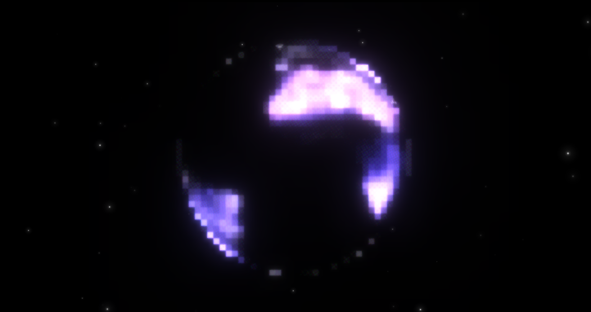

ThreeJS landing page with some overly complicated filters and such. Potentially good reference for alpha maps in WebGL shaders, it was very painful.
[demo site](https://calculating.github.io/sollo/)

